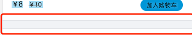
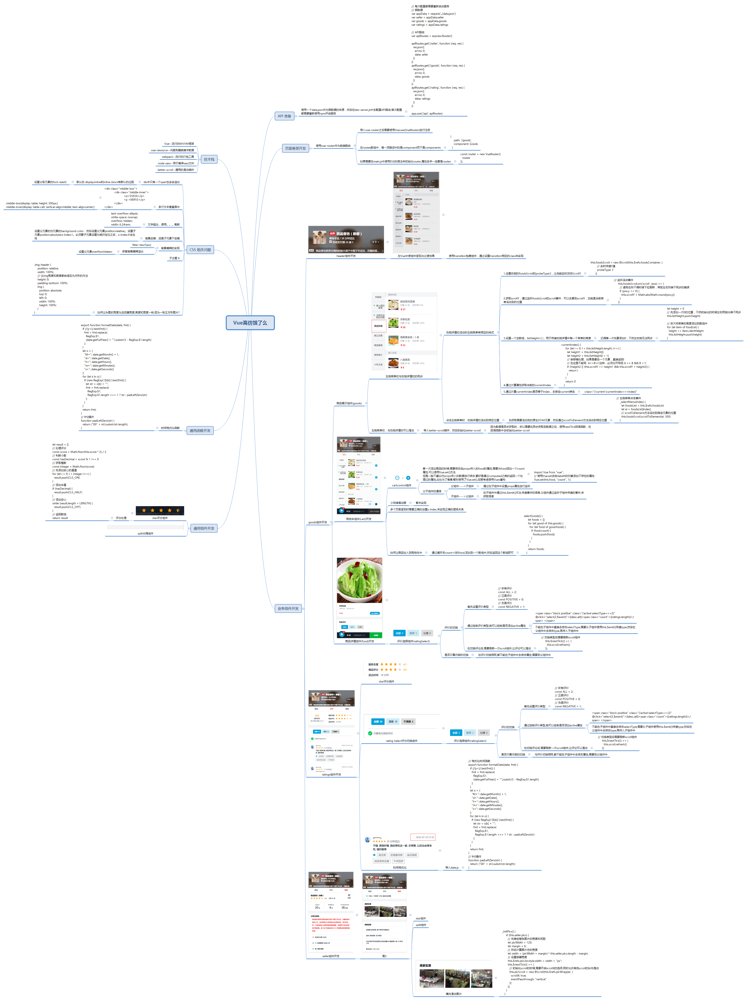

>简介

这是一个基于Vue2.0，面向移动端的仿饿了么的demo。
>技术栈

MVVM框架：Vue

前端路由：vue-router

数据获取插件：vue-resource

javascript版本：ES6

代码风格检查：ESLint

开发工具：VS Code

其他插件：better-scroll，面向移动端的滑动插件

>概述

使用了Vue进行页面骨架开发，使用vue-router进行前端路由切换，使用vue-resource进行数据获取。使用express搭建后台服务。使用eslint作为js代码风格检测。使用scss作为css预处理工具。
>业务组件

1.header组件

2.goods组件

3.ratings组件

4.seller组件

5.cart组件
>通用组件

1.star评分组件 
 
2.split组件 
 

3.ratingSelect组件 
 

4.cartControl组件 
 

>通用js

1.formatDate，处理时间的方法
>预览

>运行

1.开发者模式: 
 npm install 
             npm run dev

2.线上模式: 
 npm install 
           npm run build 
           node productServer.js

>项目总结

